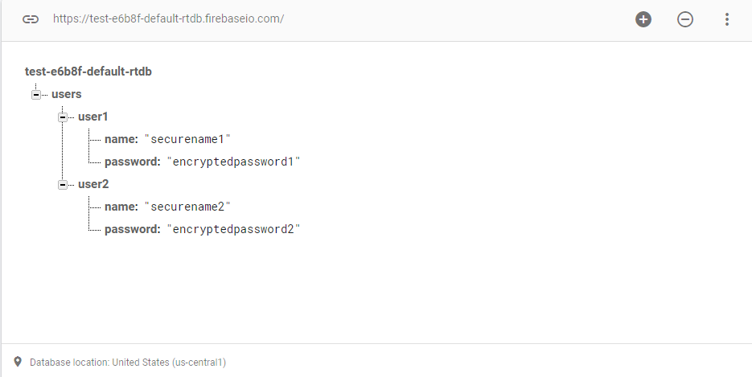

## Initialize Firebase
Go to [Firebase Console](https://console.firebase.google.com/) and create a firebase project. After that, create a realtime database and set up appropriate rules for your database and either create or add an existing database using JSON.
After that, go to the project overview, add your android app and follow the steps.

## Database Structure

This was the database structure for this template project, in an actual database, users should be stored by their user IDs and passwords should be at least salted and hashed. Since firebase is being used, you might as well use Firebase Auth to handle user passwords and let Google handle storing your user data. Check out my [UserAuthTemplate](https://github.com/mug1wara26/UserAuthTemplateAndroid) repo to get started with Firebase Auth.
